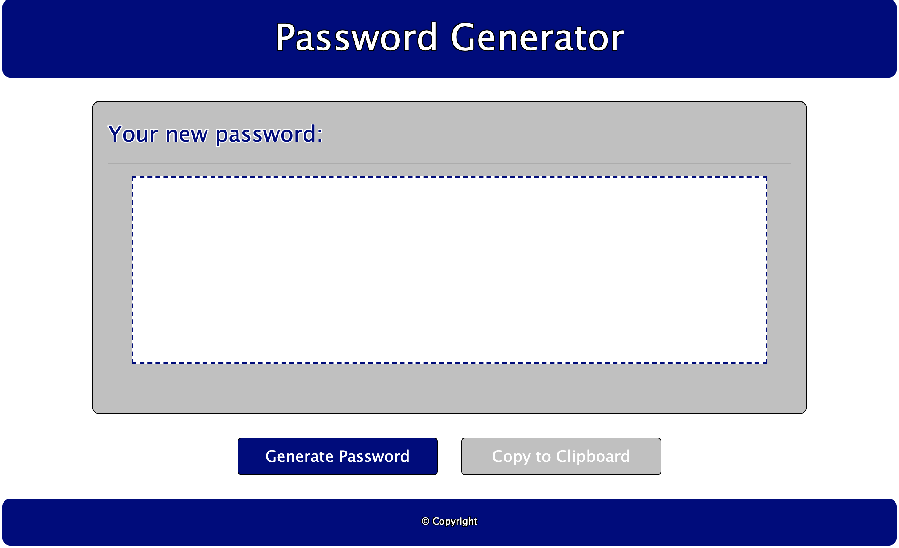

# Password Generator Application

This application is for generating random passwords.  The password can be anywhere from 8 to 128 characters.  It will allow the user to choose whether the password will contain lowercase letters, uppercase letters, numbers, and/or special characters.

Below is a screenshot of the application:

The application works as follows:

-Open the application at https://kwheintz.github.io/Password-Generator/
-Click the blue "Generate Password" to begin the process.
-Enter a password length between 8 and 128 in the prompt.
-Confirm whether or not the password should contain lower case letters.  Press "OK" to include lower case letters and press cancel to exclude.
-Confirm whether or not the password should contain upper case letters.  Press "OK" to include upper case letters and press cancel to exclude.
-Confirm whether or not the password should contain numbers.  Press "OK" to include numbers and press cancel to exclude.
-Confirm whether or not the password should contain special characters.  Press "OK" to include special characters and press cancel to exclude.
        *Note: At least one character must be confirmed, or the prompt will ask you to select character types again until at least one is selected.
-The newly generated password will appear within the white boxed with dashed border.

